# Data Lakehouse

> Note all of the data used in the lab is generated and does not in any way reflect situation on the stock markets

- [Data Lakehouse](#data-lakehouse)
  - [1. Introduction](#1-introduction)
    - [Presto](#presto)
    - [Spark](#spark)
  - [2. Prerequisites](#2--prerequisites)
  - [3. Data overview](#3-data-overview)
  - [4. Expected outcome](#4-expected-outcome)
  - [5. Presto Data Insertion](#5-presto-data-insertion)
    - [5.1 Open watsonx.ai Project](#51-open-watsonxai-project)
    - [5.2 Import Jupyter Notebook with the script from local folder](#52-import-jupyter-notebook-with-the-script-from-local-folder)
    - [5.3 Open and run the Jupyter Notebook](#53-open-and-run-the-jupyter-notebook)
    - [5.4 Review data in watsonx.data UI after Presto part of the lab (watsonx.data back-end)](#54-review-data-in-watsonxdata-ui-after-presto-part-of-the-lab-watsonxdata-back-end)
  - [6. Spark pre-processing: submit spark app in watsonx.data UI](#6-spark-pre-processing-submit-spark-app-in-watsonxdata-ui)
    - [6.1 Save spark script to COS bucket and generate payload json](#61-save-spark-script-to-cos-bucket-and-generate-payload-json)
    - [6.2 Open and run the Jupyter Notebook](#62-open-and-run-the-jupyter-notebook)
    - [6.3 Submit spark app in watsonx.data UI (watsonx.data back-end)](#63-submit-spark-app-in-watsonxdata-ui-watsonxdata-back-end)
    - [6.4 Check Status](#64-check-status)
    - [6.5 Review data in watsonx.data UI after spark processing](#65-review-data-in-watsonxdata-ui-after-spark-processing)

## 1. Introduction

The :dart: **purpose** of this Lab is to demonstrate:

- Workflow with hive and iceberg catalogs to handle different data tasks.
- Support for data federation so that data can be consumed from the source rather than making additional copies.
- Using the fit for purpose engine (Spark) to Transform, aggregate and cleanse the data in-order to expose high quality data for Analytical and AI applications.

#### Presto

In `Presto data insertion` you will first :memo: register data located in hive bucket to hive catalog as external tables, then :inbox_tray: ingest some of the data into iceberg catalog (accounts table) associated with the presto engine.

#### Spark Pre-processing for Holdings Table

In this step, you'll use Spark to prepare the `holdings_table` for the year **2024**, focusing on specific stocks based on the tables offloaded from Netezza in the previous lab.
Once the 2024 holdings are prepared, they will be **combined with holdings data up to 2023**, which includes a predefined set of stocks. This merged dataset will form the complete `holdings_table`, which will be used in subsequent analysis steps alongside the `accounts_table`.
Additionally, the `bankdemo.customers_table` from the Postgres database has been **federated to the `watsonx.data` Postgres catalog as part of the lab prerequisites. No further changes are required, and it will be used as-is in the upcoming steps.

## 2. Prerequisites

- Completed [Environment Setup](/env-setup/README.md)
- Completed Datawarehouse Optimization Lab

## 3. Data overview

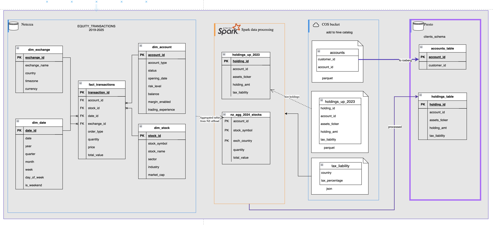

**:card_file_box: Sources of data**

- files in COS hive bucket
  - Go to your COS instance https://cloud.ibm.com/objectstorage/instances -> select bucket of name `hive-catelog-enablement-bucket` -> search for `input_data_hive` directory, there you should find folders/files that were pre-uploaded for you by instructor, if not raise concerns:
    - `accounts_ht` contains the list of account ids and customer ids from the internal system dump;
    - `holdings_ht`contains information on accounts and their stock holdings (unique by account_id and asset_ticker) for the previous period up to 2023, where `asset_ticker` is stock symbol, `holding_amt` is the total amount of a particular stock and `tax_liability` is the remaining tax liability still owed;
    - `tax_liability_ht` contains country specific tax rate;
- watsonx.data schema
  - `iceberg_catalog.<SCHEMA_DWH_OFFLOAD>` contains data offloaded from Netezza;
  - `postgres_catalog.bankdemo.customers_table` is a federated postgres table that contains customer data.

## 4. Expected outcome

At the end of the lab you should have 2 tables in watsonx.data `clients_schema_<YourName_First3LettersOfSurname>`

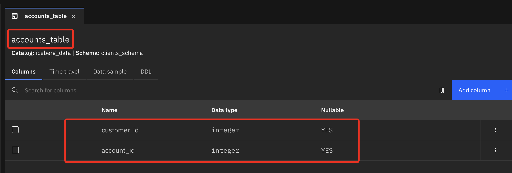

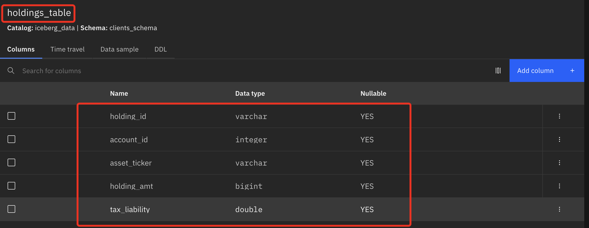

## 5. Presto Data Insertion

### 5.1 Open watsonx.ai Project

1. Open your watsonx.ai project at [watsonx](https://dataplatform.cloud.ibm.com/wx/home?context=wx). The project will have your name as the suffix.
2. Check that you can see env.txt file in the list of all assets on `Assets` tab
   
3. Check that Connections are available, we will be using them in the lab
   

### 5.2 Import Jupyter Notebook with the script from local folder

1. Go to project Assets, select `New asset +`:
   

2. Select `Work with data and models in Python or R notebooks` asset type
   

3. Import Jupyter Notebook from local file:
   

4. Select `Data_Lakehouse/wx-data/1_presto_wxai.ipynb`
   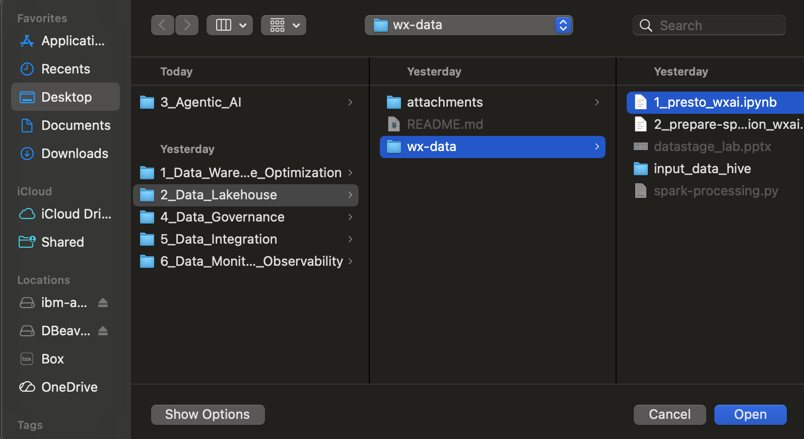

5. Append name with your initials: `-name-first3lettersSurname` and click `Create`
   

### 5.3 Open and run the Jupyter Notebook

1. It should open automatically right after creation, if not then from `Your Project` -> `Assets`:

   - click on the Jupyter Notebook
   - and then click on pencil to Edit, it will open Jupyter Notebook in edit mode
     

2. Trust Jupyter Notebook in the right upper corner:
   
3. Add a Project Token to reach assets from the Project

   - Click on the second cell with import so it's active
   - Insert cell below by clicking on `+` sign
     
   - From the upper menu select 3 dots sign to insert a project token snippet:
     
   - So now it should look like this (sequence is important):
     

4. Run all cells consequtively starting from packages installations in the first cell and check outputs

### 5.4 Review data in watsonx.data UI after Presto part of the lab (watsonx.data back-end)

1. In a different window, open watsonx.data Service

2. From the Hamburger menu on the top left go to `Data manager`

3. Verify tables were added to `hive_catalog.input_data_hive_YourName_First3LettersOfSurname`
    

4. Verify `accounts_table` was added to `iceberg_catalog.clients_schema_YourName_First3LettersOfSurname`

## 6. Spark pre-processing: submit spark app in watsonx.data UI

### 6.1 Save spark script to COS bucket and generate payload json

1.  Return to the watsonx.ai Project you created during [Environment Setup](/env-setup/README.md)

2.  Load Script to the Project:

    - From `Assets` Tab click `Import assets`
      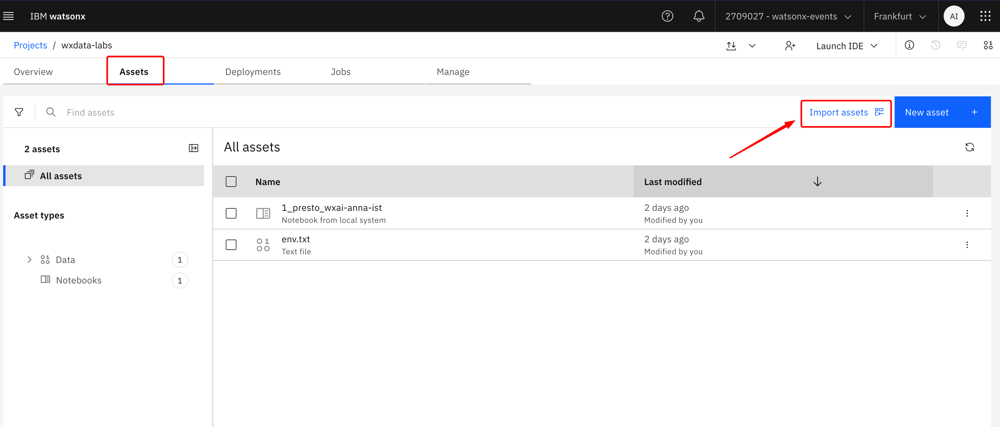
    - Select `Local file` -> `Data asset` -> `Browse`
    - From local files under Data_Lakehouse, select `/wx-data/spark-processing.py` script and click `Open`
      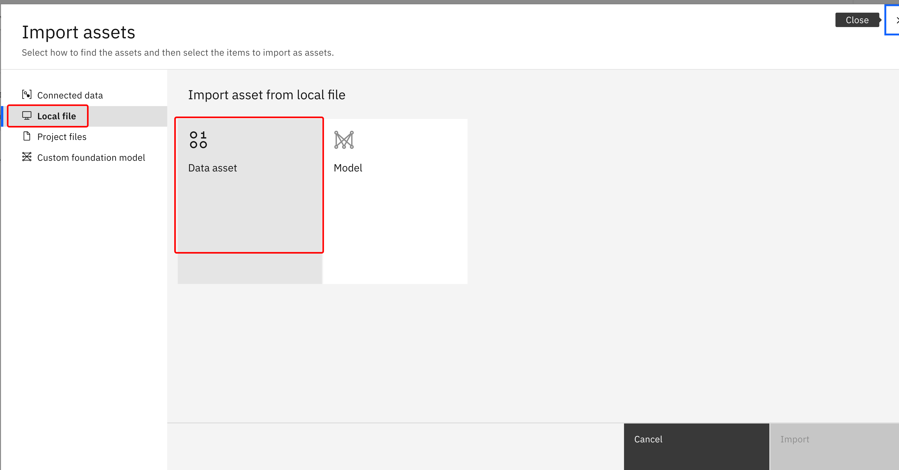
    - Once loaded, click `Done`
      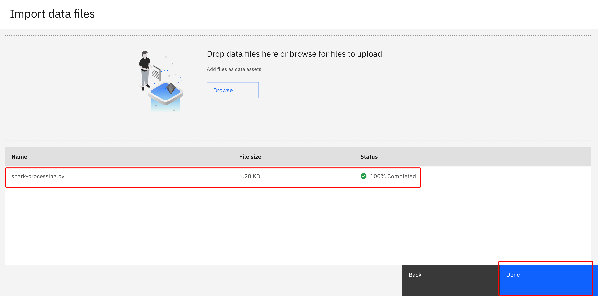
    - You should see the script in the list of assets available (`Data`)

3.  Import Jupyter Notebook [./wx-data/2_prepare-spark-app-submission_wxai.ipynb](./wx-data/2_prepare-spark-app-submission_wxai.ipynb) from local folder into the Project:
    _ Go to project Assets, select `New asset +`:
    
    _ Select `Work with data and models in Python or R notebooks` asset type
    

         * Import Jupyter Notebook from local file:

    

    - Select [./wx-data/2_prepare-spark-app-submission_wxai.ipynb](./wx-data/2_prepare-spark-app-submission_wxai.ipynb) from local folder

    - Append name with your initials: `-name-first3lettersSurname` and click `Create`

    

### 6.2 Open and run the Jupyter Notebook

1. It should open automatically right after creation, if not then from `Your Project` -> `Assets`:
   - click on the Jupyter Notebook
   - and then click on pencil to Edit, it will open Jupyter Notebook in edit mode
     
2. Trust Jupyter Notebook by clicking `Not Trusted` in the right upper corner and then `Trust`:
   

3. Add a Project Token to reach assets from the Project

   - Click on the first cell with import so it's active
   - Insert cell below by clicking on `+` sign
     
   - From the upper menu select 3 dots sign to insert a project token snippet:
     
   - So now it should look like this (sequence is important):
     

4. Run all cells consequitively starting from packages installations in the first cell and check outputs

- :warning: The notebook will prompt for a Cloud API Key. When prompted, please paste the `watsonx.data back-end Cloud API key` that was provided by the instructor and press `Enter`. Do not use your client CLOUD_API_KEY here.
- :warning: The `spark.hadoop.fs.s3a.secret.key`and `spark.hadoop.fs.s3a.access.key` will be provided.
- A successful run will include the payload to your spark app submission in the last cell in json format.
- Copy the `payload` to your reference note, you will use it for your spark app submission.

### 6.3 Submit spark app in watsonx.data UI (watsonx.data back-end)

1. Return to watsonx.data Service.
2. From the Hamburger menu on the top left go to `Infrastructure manager`
3. Click on the `Spark` engine
4. Go to `Spark history` tab and make sure that spark history server has started, if not start with the default configuration
5. Go to `Applications` Tab and click on `Create application +`
   
6. Go to `Payload` tab and paste the payload data (json output) from Jupyter Notebook (that you've saved to your Reference Note)
   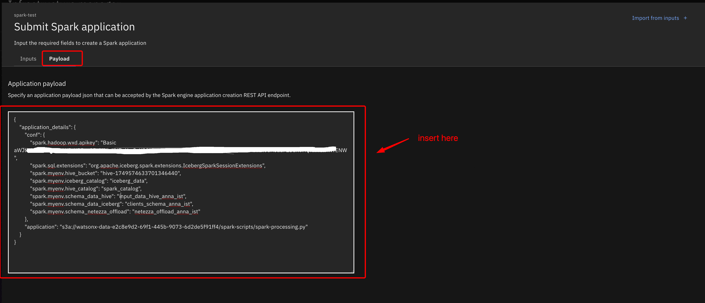
7. Go to `Inputs` Tab and in the right upper corner click in `Import from payload +`
   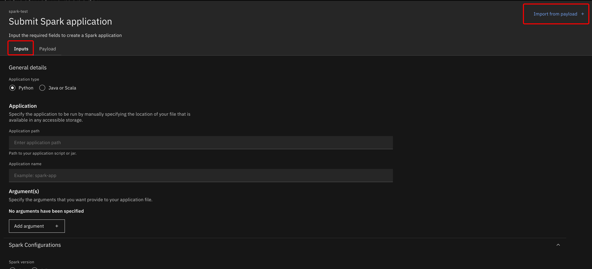
8. Fill in the remaining parameters:
   - Application type - Python
   - Application name - `spark-processing`
   - Spark version - 3.4
     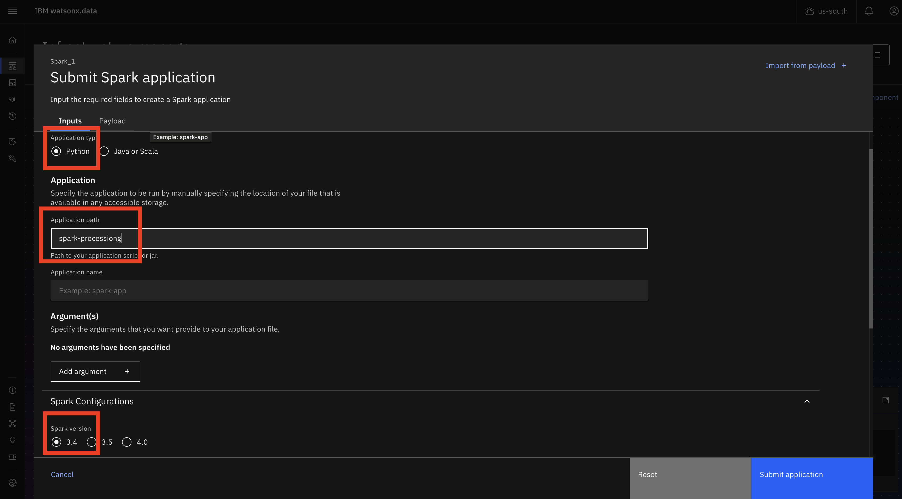
9. Click `Submit application`

### 6.4 Check Status

1. A new app will appear in the Applications list.

   - Take note of the `ID` of your Spark Job in the shared environment. You will use this later to find your spark logs.
   - To update status, press on refresh sign in upper menu
     

2. Check event logs with detailed status of jobs in `Spark history`:
   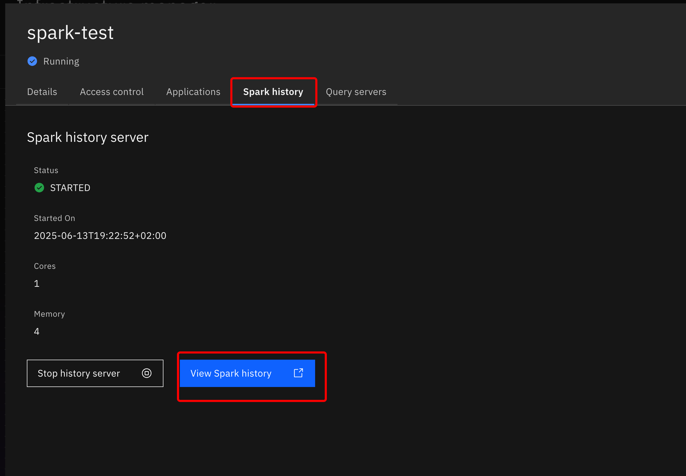
   _ Click on the latest app
   _ Explore Jobs, Stages, SQL/DataFrame

### 6.5 Review data in watsonx.data UI after spark processing

1. From the Hamburger menu on the top left go to `Data manager`

2. Verify `holdings_table` is available in `iceberg_data."clients_schema_YourName_First3LettersOfSurname"`
   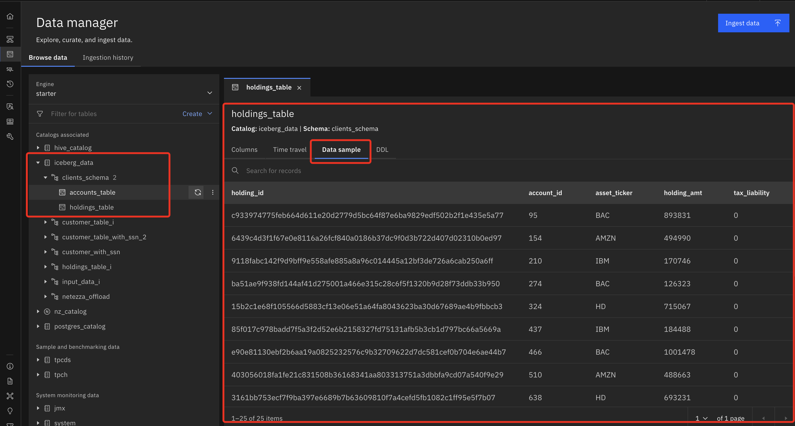
